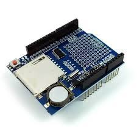
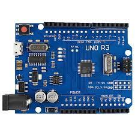

# Data Logger Shield para Arduino com RTC DS1307

# Projeto: 

This project was developed asa an assignment for the discipline of Embedded Systems Programming at the federal University of Minas Gerais(UFMG). O The goal of this project was to developed a data logger shield API for arduino.

## Hardware amd software: 6

The data logger utilized was the data logger shield from adafruit.



Besides the data logger it was used an arduino uno, temperature sensors and humidity DH22.



Proteus was also used for simulations


# API

The API was develiped to allow utilize the data logger in a fast and eazy way while still keeping some flexibility.

## Fuctions

```C
DataLooger
```
Main class of the library. Needs to be declared at the beggining of the program as a global variable.

### Setup Fuctions

```C
setup()
```

Needes to be called before any other function. It will initialize the data logger and setup some basic informations.

```C
void create_file(char const* filename);      // Replace file name if filename exists.
void open_file(char const* filename);        // Open existing file. 
```

Create_File() create file and if a file with the same name exists it's replaced and open_file() opens existing file. 

```C
void log_header(char const* str);
```

log_header() writes to the header. The parameter format should be: "Name, Temperature, color, ..."

### Loop Fuctions

```C
void run()
```

Fuction resposible for write to file, sync with SD it's a template fuction and can recieve n inputs of any type.


The next fuctions needes to be used as a run()'s substitute, and has the objective to give more control for the user. 

```C
void log_time();
```

Writes date, hour and miliseconds since start.

```C
void record()
```

Writes data to sd. It's a template function and can recieve n inputs of any type.

```C
void sync();
```

Sync data with SD.

```C
void set_time(uint16_t year, uint8_t month, uint8_t day, uint8_t hour = 0, uint8_t min = 0, uint8_t sec = 0);
```

Adjust Real time clock.

```C
void writing_LED();
void syncing_LED();
```

Run LED paterns for writing(blink green LED) and syncing(blink green and red LED).

## Variables:

The variable are private and can be acessed and modified through a get() and set()

```C
int m_redLEDpin;
void set_red_Led_pin(int redLED);
int get_red_Led_pin();
```

```C
int m_greenLEDpin;
void set_green_Led_pin(int greenLED);
int get_red_Led_pin();
```

```C
int m_SDpin;
void set_SD_pin(int const SDpin);
int get_SD_pin(); 
```

```C
int m_sync_interval;
void set_sync_interval(int const sync_interval);
int get_sync_interval();
```

```C
int m_log_interval;
void set_sync_interval(int const sync_interval);
int get_sync_interval();
```

```C
RTC_DS1307  m_RTC;
RTC_DS1307 get_real_time_clock();
```

### Flags

```C
uint8_t  m_flags;  

FLAG_WRITING_LED
FLAG_SYNCING_LED  
FLAG_LOG_DATE_TIME
FLAG_SLEEP_MODE
``` 

```C
void enable_writingLED()    // Enable LED pattern when writing. (blink green LED)
void disable_writingLED()
void enable_syncingLED()    // Enable LED pattern when syncing. (blink green and red LED)
void disable_syncingLED()
void enable_time_log()      // Enable right time log to log_time().
void disable_time_log()
``` 

```C
void wake_up();
void sleep();
```

Sleep set FLAG_SLEEP_MODE to 0 and wake_up() to 1.

# Reference

https://learn.adafruit.com/adafruit-data-logger-shield
https://store.arduino.cc/usa/arduino-uno-rev3
